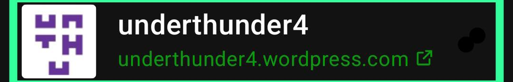

pocman
=========================
The content next was made (and tested) totally on:
* Godot_v4.2.2-stable_android_editor.apk

And tested on:
* Godot_v4.3-beta2_android_editor.apk
* Godot_v4.3-beta3_android_editor.apk

all in a real Android 14 6,5'' phone!

pocman is a test (not a game yet) project "Godot 4" for my work in progress article (or based in) [DEVELOPING A GAME AND PARTICIPATING IN GODOT JAM 2024, ALL FROM MY SAMSUNG GALAXY A34](https://underthunder4.wordpress.com/2024/05/20/developing-a-game-and-joining-to-godot-jam-2024-all-from-a-samsung-galaxy-a34-day-4/)

in:

Features
---------------------------

- Mininal project configuration (default too).

    Added minimal export_preset.cfg file for ease on get Web Export functionality...
    and...

    A little configurations for maximize the
    
     **Godot Android Editor 4.2.2stable** dialog window "export" into the visible screen area and reach the HTML5 Web export function ("Export PCK/ZIP..." button), 
    
        touching the file: .godot/editor/project_metadata.cfg like this:
        [dialog_bounds]
    
        export=Rect2(255, 0, 1620, 850)
    
        And appending:
        
        `textures/vram_compression/import_s3tc_bptc=true`
        
        To:
        project.godot
        
- All program was coded, non GUI handling/config
- Uses Godot_v4.3-beta2_export_templates.tpz
- Godot_v4.2.2-stable_android_editor compat.
- Godot_v4.3-beta2_android_editor compat.
- Godot_v4.3-beta3_android_editor compat.
- Uses const
- Uses signal
- Implements AStarGrid2D
- Implements Tween
- Implements Area2D
- Implements CollisionShape2D

My Workflow for Godot Web Building/Testing in Android
---------------------------
1. Go to PROJECT>EXPORT in menu, select the Web export preset and save the build as game.zip into the 'Build' directory
2. Install [Acode Editor (Android code editor\)](https://f-droid.org/packages/com.foxdebug.acode/)
3. Open the 'Build/game.html' file Adding the 'pocman' dir as PATH
4. Replace the server port (8158) for yours (configurated in Acode app) in this entries:
    ``
    
    And in:
    
    `const myPck = 'http://localhost:8158/game.zip'`
`const myWasm = 'http://localhost:8158/web_nothreads_release_4_3beta2/godot'`
1. While in 'game.html' opened file hit the play button in Acode. A browser will be opened with the Godot Engine and the "game.zip" will begin to load...
